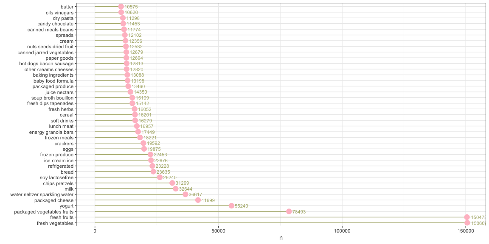
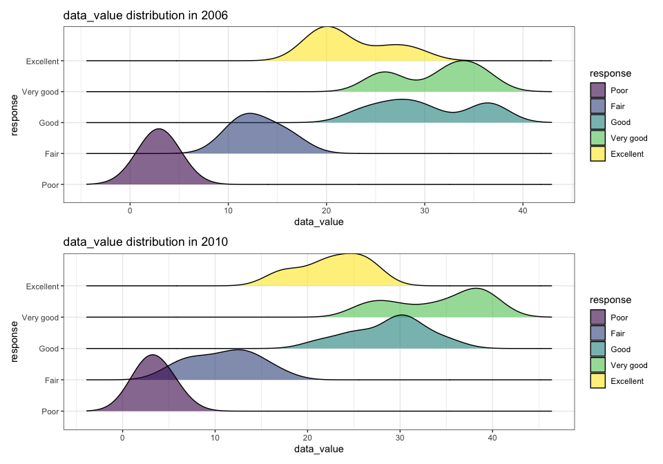

P8105_hw3_cx2257
================
Congyang Xie
10/17/2021

## Problem 1

``` r
library(p8105.datasets)
force(data("instacart"))
```

1.  **Description of the dataset**: The instacart dataset contains
    1384617 observations and 15 variables. The varibales are order_id,
    product_id, add_to_cart_order, reordered, user_id, eval_set,
    order_number, order_dow, order_hour_of_day, days_since_prior_order,
    product_name, aisle_id, department_id, aisle, department. The
    dataset inclueds 39123 different products, which belongs to 134
    aisles in 21 departments. The dataset records how products get added
    into different shopping carts by different users and the products’
    information as well. For example, Bulgarian Yogurt was added to the
    order 1 by customer whose user id is 112108 at 10 o’clock, which is
    the 1st product added to the cart.

2.  **How many aisles are there, and which aisles are the most items
    ordered from?**

There are 134 aisles. The top 3 aisles that are frequently ordered from
are stated below:

``` r
instacart %>% 
  count(aisle) %>%
  arrange(desc(n)) %>%
  head(3) %>%
  knitr::kable()
```

| aisle                      |      n |
|:---------------------------|-------:|
| fresh vegetables           | 150609 |
| fresh fruits               | 150473 |
| packaged vegetables fruits |  78493 |

3.  **Make a plot that shows the number of items ordered in each aisle,
    limiting this to aisles with more than 10000 items ordered. Arrange
    aisles sensibly, and organize your plot so others can read it.**

``` r
instacart %>%
  count(aisle) %>%
  filter(n > 10000) %>%
  arrange(desc(n)) %>%
  mutate(aisle = factor(aisle, levels = aisle)) %>%
  ggplot(aes(x = aisle, y = n)) +
  geom_segment(aes(xend = aisle, yend = 1)) +
  geom_point(size = 4, color = "pink") +
  coord_flip() +
  theme_bw() +
  xlab("")
```

<!-- -->

4.  **Make a table showing the three most popular items in each of the
    aisles “baking ingredients”, “dog food care”, and “packaged
    vegetables fruits”. Include the number of times each item is ordered
    in your table.**

``` r
freq_prod <- instacart %>%
  filter(aisle == c(
    "baking ingredients",
    "dog food care",
    "packaged vegetables fruits"
  )) %>%
  select(aisle, product_name) %>%
  group_by(aisle) %>%
  count(product_name, sort = TRUE) %>%
  top_n(n = 3, wt = product_name) %>%
  arrange(aisle, desc(n))

freq_prod %>% knitr::kable() 
```

| aisle                      | product_name                                     |   n |
|:---------------------------|:-------------------------------------------------|----:|
| baking ingredients         | Zero Calorie Sweetener                           |  31 |
| baking ingredients         | Yellow Enriched & Degerminated Corn Meal         |   1 |
| baking ingredients         | Zero Calorie Sweetener Packets 50 Count          |   1 |
| dog food care              | With Chicken & Veal in Meaty Juices Wet Dog Food |   2 |
| dog food care              | With Chicken & Beef in Meaty Juices Wet Dog Food |   1 |
| dog food care              | Zero Grain Turkey Dog Food                       |   1 |
| packaged vegetables fruits | Zucchini Noodles                                 |  60 |
| packaged vegetables fruits | Yukon Gold Potato                                |  22 |
| packaged vegetables fruits | Zucchini Squash, Baby Courgette                  |   3 |

5.  **Make a table showing the mean hour of the day at which Pink Lady
    Apples and Coffee Ice Cream are ordered on each day of the week;
    format this table for human readers (i.e. produce a 2 x 7 table).**

``` r
order_mean_hour_df <- 
  instacart %>%
  select(product_name, order_dow, order_hour_of_day) %>%
  filter(product_name == c("Pink Lady Apples", "Coffee Ice Cream")) %>%
  group_by(product_name, order_dow) %>%
  mutate(order_mean_hour = mean(order_hour_of_day)) %>%
  arrange(product_name, order_dow) %>%
  select(-order_hour_of_day) %>%
  distinct() %>%
  pivot_wider(names_from = order_dow, values_from = order_mean_hour)
  

names(order_mean_hour_df)[2:8] <- c("Sunday", "Monday", "Tuesday", "Wednesday", "Thursday", "Friday", "Saturday")
order_mean_hour_df %>% knitr::kable(caption = "The mean hour of items ordered each weekday", digits = 2)
```

| product_name     | Sunday | Monday | Tuesday | Wednesday | Thursday | Friday | Saturday |
|:-----------------|-------:|-------:|--------:|----------:|---------:|-------:|---------:|
| Coffee Ice Cream |  13.22 |  15.00 |   15.33 |     15.40 |    15.17 |  10.33 |    12.35 |
| Pink Lady Apples |  12.25 |  11.68 |   12.00 |     13.94 |    11.91 |  13.87 |    11.56 |

The mean hour of items ordered each weekday

## Problem 2

``` r
# load data
force(data("brfss_smart2010"))
```

``` r
# clean and tidy data

brfss_df <-
  brfss_smart2010 %>%
  janitor::clean_names() %>%
  filter(topic == "Overall Health") %>%
  mutate(response = factor(
    response,
    levels = c("Poor", "Fair", "Good", "Very good", "Excellent")
  ))
```

1.  In 2002, which states were observed at 7 or more locations? What
    about in 2010?

In 2002, states that were obeserved at least 7 locations are stated
below:

``` r
brfss_df %>%
  select(year, locationabbr, locationdesc) %>%
  filter(year == 2002) %>%
  group_by(locationabbr) %>%
  summarise(n_obs = n_distinct(locationdesc)) %>%
  filter(n_obs > 6) %>%
  arrange(desc(n_obs)) %>%
  knitr::kable(caption = "states that were obeserved at least 7 locations in 2002")
```

| locationabbr | n_obs |
|:-------------|------:|
| PA           |    10 |
| MA           |     8 |
| NJ           |     8 |
| CT           |     7 |
| FL           |     7 |
| NC           |     7 |

states that were obeserved at least 7 locations in 2002

In 2010, states that were obeserved at least 7 locations are stated
below:

``` r
brfss_df %>%
  select(year, locationabbr, locationdesc) %>%
  filter(year == 2010) %>%
  group_by(locationabbr) %>%
  summarise(n_obs = n_distinct(locationdesc)) %>%
  filter(n_obs > 6) %>%
  arrange(desc(n_obs)) %>%
  knitr::kable(caption = "states that were obeserved at least 7 locations in 2010")
```

| locationabbr | n_obs |
|:-------------|------:|
| FL           |    41 |
| NJ           |    19 |
| TX           |    16 |
| CA           |    12 |
| MD           |    12 |
| NC           |    12 |
| NE           |    10 |
| WA           |    10 |
| MA           |     9 |
| NY           |     9 |
| OH           |     8 |
| CO           |     7 |
| PA           |     7 |
| SC           |     7 |

states that were obeserved at least 7 locations in 2010

2.  Construct a dataset that is limited to Excellent responses, and
    contains, year, state, and a variable that averages the data_value
    across locations within a state. Make a “spaghetti” plot of this
    average value over time within a state (that is, make a plot showing
    a line for each state across years – the geom_line geometry and
    group aesthetic will help).

``` r
excellent_df <- 
  brfss_df %>%
  filter(response == "Excellent") %>%
  group_by(locationabbr, year) %>%
  summarise(avg_data_value = mean(data_value, na.rm = TRUE)) 
```

    ## `summarise()` has grouped output by 'locationabbr'. You can override using the `.groups` argument.

``` r
excellent_df %>%
  ggplot(aes(x = year, y = avg_data_value)) +
  geom_line(aes(group = locationabbr, color = locationabbr)) +
  viridis::scale_color_viridis(discrete = T) +
  theme_bw()
```

<!-- -->

3.  Make a two-panel plot showing, for the years 2006, and 2010,
    distribution of data_value for responses (“Poor” to “Excellent”)
    among locations in NY State.

``` r
data_value_06 <-
  brfss_df %>%
  filter(year == 2006, 
         response == "Poor" | response == "Excellent",
         locationabbr == "NY") %>%
  ggplot(aes(x = locationdesc, y = data_value, fill = response)) +
  geom_bar(position = "dodge", stat = "identity") +
  viridis::scale_fill_viridis(discrete = TRUE) +
  theme_bw()

data_value_10 <-
  brfss_df %>%
  filter(year == 2010, 
         response == "Poor" | response == "Excellent",
         locationabbr == "NY") %>%
  ggplot(aes(x = locationdesc, y = data_value, fill = response)) +
  geom_bar(position = "dodge", stat = "identity") +
  viridis::scale_fill_viridis(discrete = TRUE) +
  theme_bw()

data_value_06 / data_value_10
```

<!-- -->
