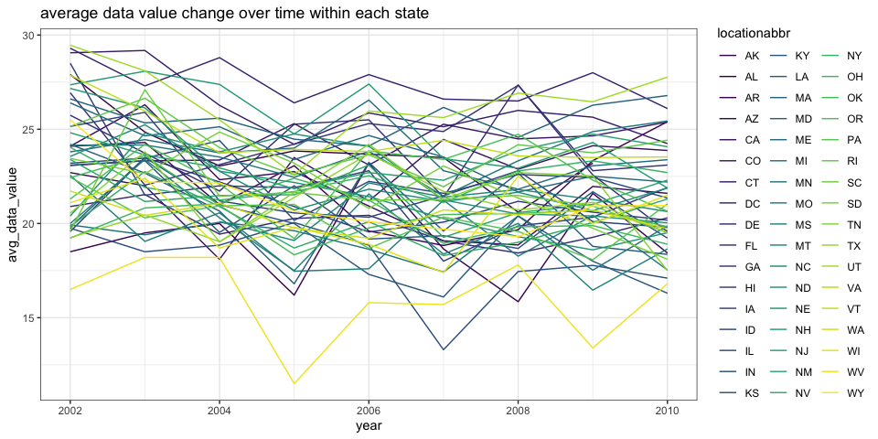

P8105_hw3_cx2257
================
Congyang Xie
10/17/2021

## Problem 1

``` r
library(p8105.datasets)
data("instacart")
```

1.  **Description of the dataset**: The instacart dataset contains
    1384617 observations and 15 variables. The varibales are order_id,
    product_id, add_to_cart_order, reordered, user_id, eval_set,
    order_number, order_dow, order_hour_of_day, days_since_prior_order,
    product_name, aisle_id, department_id, aisle, department. The
    dataset inclueds 39123 different products, which belongs to 134
    aisles in 21 departments. The dataset records how products get added
    into different shopping carts by different users and the products’
    information as well. For example, Bulgarian Yogurt was added to the
    order 1 by customer whose user id is 112108 at 10 o’clock, which is
    the 1st product added to the cart.

2.  **How many aisles are there, and which aisles are the most items
    ordered from?**

There are 134 aisles. The top 3 aisles that are frequently ordered from
are stated below:

``` r
instacart %>% 
  count(aisle) %>%
  arrange(desc(n)) %>%
  head(3) %>%
  knitr::kable()
```

| aisle                      |      n |
|:---------------------------|-------:|
| fresh vegetables           | 150609 |
| fresh fruits               | 150473 |
| packaged vegetables fruits |  78493 |

We can tell by the table that the most popular categories in the store
is fresh fruits and vegetables.

3.  **Make a plot that shows the number of items ordered in each aisle,
    limiting this to aisles with more than 10000 items ordered. Arrange
    aisles sensibly, and organize your plot so others can read it.**

``` r
instacart %>%
  count(aisle) %>%
  filter(n > 10000) %>%
  arrange(desc(n)) %>%
  mutate(aisle = factor(aisle, levels = aisle)) %>%
  ggplot(aes(x = aisle, y = n)) +
  geom_segment(aes(xend = aisle, yend = 1), color = "#B1B479") +
  geom_point(size = 4, color = "pink") +
  geom_text(aes(label = n), color = "#B1B479", hjust = -0.25, size = 3) +
  coord_flip() +
  theme_bw() +
  xlab("")
```

<!-- -->

The aisles are ordered by number of items ordered in corresponding
aisle.

4.  **Make a table showing the three most popular items in each of the
    aisles “baking ingredients”, “dog food care”, and “packaged
    vegetables fruits”. Include the number of times each item is ordered
    in your table.**

``` r
freq_prod <- instacart %>%
  filter(aisle %in% c(
    "baking ingredients",
    "dog food care",
    "packaged vegetables fruits"
  )) %>%
  group_by(aisle, product_name) %>%
  summarise(n = n()) %>% 
  top_n(n = 3, wt = n)
```

    ## `summarise()` has grouped output by 'aisle'. You can override using the `.groups` argument.

``` r
freq_prod %>% knitr::kable() 
```

| aisle                      | product_name                                  |    n |
|:---------------------------|:----------------------------------------------|-----:|
| baking ingredients         | Cane Sugar                                    |  336 |
| baking ingredients         | Light Brown Sugar                             |  499 |
| baking ingredients         | Pure Baking Soda                              |  387 |
| dog food care              | Organix Chicken & Brown Rice Recipe           |   28 |
| dog food care              | Small Dog Biscuits                            |   26 |
| dog food care              | Snack Sticks Chicken & Rice Recipe Dog Treats |   30 |
| packaged vegetables fruits | Organic Baby Spinach                          | 9784 |
| packaged vegetables fruits | Organic Blueberries                           | 4966 |
| packaged vegetables fruits | Organic Raspberries                           | 5546 |

The most popular products in baking ingredients are sugar and soda. The
dog food care aisle is relatively less popular than the other 2
categories. The most popular products in packaged vegetables and fruits
are all organic food.

5.  **Make a table showing the mean hour of the day at which Pink Lady
    Apples and Coffee Ice Cream are ordered on each day of the week;
    format this table for human readers (i.e. produce a 2 x 7 table).**

``` r
order_mean_hour_df <- 
  instacart %>%
  select(product_name, order_dow, order_hour_of_day) %>%
  filter(product_name %in% c("Pink Lady Apples", "Coffee Ice Cream")) %>%
  group_by(product_name, order_dow) %>%
  mutate(order_mean_hour = mean(order_hour_of_day)) %>%
  arrange(product_name, order_dow) %>%
  select(-order_hour_of_day) %>%
  distinct() %>%
  pivot_wider(names_from = order_dow, values_from = order_mean_hour)
  

names(order_mean_hour_df)[2:8] <- c("Sunday", "Monday", "Tuesday", "Wednesday", "Thursday", "Friday", "Saturday")
order_mean_hour_df %>% knitr::kable(caption = "The mean hour of items ordered each weekday", digits = 2)
```

| product_name     | Sunday | Monday | Tuesday | Wednesday | Thursday | Friday | Saturday |
|:-----------------|-------:|-------:|--------:|----------:|---------:|-------:|---------:|
| Coffee Ice Cream |  13.77 |  14.32 |   15.38 |     15.32 |    15.22 |  12.26 |    13.83 |
| Pink Lady Apples |  13.44 |  11.36 |   11.70 |     14.25 |    11.55 |  12.78 |    11.94 |

The mean hour of items ordered each weekday

It seems that customers tend to order coffee ice cream in the afternoon,
probably people usually feel sleepy at that time and need to be
refreshed. The pink lady apple is more likely to be ordered at noon,
probably people want to have some fruit after lunch.

## Problem 2

``` r
# load data
force(data("brfss_smart2010"))
```

``` r
# clean and tidy data

brfss_df <-
  brfss_smart2010 %>%
  janitor::clean_names() %>%
  filter(topic == "Overall Health") %>%
  mutate(response = factor(
    response,
    levels = c("Poor", "Fair", "Good", "Very good", "Excellent") # response order from poor to excellent
  ))
```

1.  In 2002, which states were observed at 7 or more locations? What
    about in 2010?

In 2002, states that were obeserved at least 7 locations are stated
below:

``` r
brfss_df %>%
  select(year, locationabbr, locationdesc) %>%
  filter(year == 2002) %>%
  group_by(locationabbr) %>%
  summarise(n_obs = n_distinct(locationdesc)) %>%
  filter(n_obs > 6) %>%
  arrange(desc(n_obs)) %>%
  knitr::kable(caption = "states that were obeserved at least 7 locations in 2002")
```

| locationabbr | n_obs |
|:-------------|------:|
| PA           |    10 |
| MA           |     8 |
| NJ           |     8 |
| CT           |     7 |
| FL           |     7 |
| NC           |     7 |

states that were obeserved at least 7 locations in 2002

In 2010, states that were obeserved at least 7 locations are stated
below:

``` r
brfss_df %>%
  select(year, locationabbr, locationdesc) %>%
  filter(year == 2010) %>%
  group_by(locationabbr) %>%
  summarise(n_obs = n_distinct(locationdesc)) %>%
  filter(n_obs > 6) %>%
  arrange(desc(n_obs)) %>%
  knitr::kable(caption = "states that were obeserved at least 7 locations in 2010")
```

| locationabbr | n_obs |
|:-------------|------:|
| FL           |    41 |
| NJ           |    19 |
| TX           |    16 |
| CA           |    12 |
| MD           |    12 |
| NC           |    12 |
| NE           |    10 |
| WA           |    10 |
| MA           |     9 |
| NY           |     9 |
| OH           |     8 |
| CO           |     7 |
| PA           |     7 |
| SC           |     7 |

states that were obeserved at least 7 locations in 2010

The 2002 data are mostly observed in eastern states comparing with the
2010 data.

2.  Construct a dataset that is limited to Excellent responses, and
    contains, year, state, and a variable that averages the data_value
    across locations within a state. Make a “spaghetti” plot of this
    average value over time within a state (that is, make a plot showing
    a line for each state across years – the geom_line geometry and
    group aesthetic will help).

``` r
excellent_df <- 
  brfss_df %>%
  filter(response == "Excellent") %>%
  group_by(locationabbr, year) %>%
  summarise(avg_data_value = mean(data_value, na.rm = TRUE)) 
```

    ## `summarise()` has grouped output by 'locationabbr'. You can override using the `.groups` argument.

``` r
excellent_df %>%
  ggplot(aes(x = year, y = avg_data_value)) +
  geom_line(aes(group = locationabbr, color = locationabbr)) +
  viridis::scale_color_viridis(discrete = T) +
  ggtitle("average data value change over time within each state") +
  theme_bw()
```

<!-- --> As
filtered by excellent response, the data values are mostly distributed
above 20, but the values still fluctuates from time to time and states
to states.

3.  Make a two-panel plot showing, for the years 2006, and 2010,
    distribution of data_value for responses (“Poor” to “Excellent”)
    among locations in NY State.

``` r
data_value_06 <-
  brfss_df %>%
  filter(year == 2006, 
         locationabbr == "NY") %>%
  ggplot(aes(x = data_value, y = response, fill = response)) +
  ggridges::geom_density_ridges(alpha = 0.6) +
  ggridges::theme_ridges() + 
  viridis::scale_fill_viridis(discrete = TRUE) +
  ggtitle("data_value distribution in 2006") +
  theme_bw()

data_value_10 <-
  brfss_df %>%
  filter(year == 2010, 
         locationabbr == "NY") %>%
  ggplot(aes(x = data_value, y = response, fill = response)) +
  ggridges::geom_density_ridges(alpha = 0.6) +
  ggridges::theme_ridges() + 
  viridis::scale_fill_viridis(discrete = TRUE) +
  ggtitle("data_value distribution in 2010") +
  theme_bw()

data_value_06 / data_value_10
```

<!-- --> We
can tell by the comparison of the 2 panels that the distributions of
data value between the same-level responses are generally the same.

## Problem 3

1.  Load, tidy, and otherwise wrangle the data. Your final dataset
    should include all originally observed variables and values; have
    useful variable names; include a weekday vs weekend variable; and
    encode data with reasonable variable classes. Describe the resulting
    dataset (e.g. what variables exist, how many observations, etc).

``` r
accel_data_df <- read_csv("accel_data.csv") %>%
  janitor::clean_names() %>%
  pivot_longer(
    activity_1:activity_1440,
    names_to = "act_minute",
    names_prefix = "activity_",
    values_to = "activity_counts"
  ) %>%
  mutate(
    weekday_or_weekend = if_else(day %in% c("Saturday", "Sunday"), "Weekend", "Weekday"),
    day = forcats::fct_relevel(day, c("Monday", "Tuesday", "Wednesday", 
                              "Thursday", "Friday", "Saturday", "Sunday"))
  ) 
```

**Description of the dataset**: The instacart dataset contains 50400
observations and 6 variables. The varibales are week, day_id, day,
act_minute, activity_counts, weekday_or_weekend.

2.  Traditional analyses of accelerometer data focus on the total
    activity over the day. Using your tidied dataset, aggregate accross
    minutes to create a total activity variable for each day, and create
    a table showing these totals. Are any trends apparent?

``` r
minute_activity_df <-
accel_data_df %>%
  group_by(week, day) %>%
  summarise(total_counts = sum(activity_counts)) %>%
  pivot_wider(names_from = week, values_from = total_counts, names_prefix = "week_")
```

    ## `summarise()` has grouped output by 'week'. You can override using the `.groups` argument.

``` r
knitr::kable(minute_activity_df, digits = 2)
```

| day       |    week_1 | week_2 | week_3 | week_4 | week_5 |
|:----------|----------:|-------:|-------:|-------:|-------:|
| Monday    |  78828.07 | 295431 | 685910 | 409450 | 389080 |
| Tuesday   | 307094.24 | 423245 | 381507 | 319568 | 367824 |
| Wednesday | 340115.01 | 440962 | 468869 | 434460 | 445366 |
| Thursday  | 355923.64 | 474048 | 371230 | 340291 | 549658 |
| Friday    | 480542.62 | 568839 | 467420 | 154049 | 620860 |
| Saturday  | 376254.00 | 607175 | 382928 |   1440 |   1440 |
| Sunday    | 631105.00 | 422018 | 467052 | 260617 | 138421 |

There is no apparent trend here. It seems that the patient took some
rest on the saturday of week4 and week5.

3.  Accelerometer data allows the inspection activity over the course of
    the day. Make a single-panel plot that shows the 24-hour activity
    time courses for each day and use color to indicate day of the week.
    Describe in words any patterns or conclusions you can make based on
    this graph.

``` r
hour_activity_df <-
accel_data_df %>% 
  mutate(act_hour = floor((as.numeric(act_minute)-1)/60)) %>%
  group_by(day, act_hour) %>%
  summarise(hour_sum = sum(activity_counts))
```

    ## `summarise()` has grouped output by 'day'. You can override using the `.groups` argument.

``` r
hour_activity_df %>% 
  ggplot(aes(x = act_hour, y = hour_sum)) +
  geom_line(aes(group = day, color = day)) +
  viridis::scale_fill_viridis(discrete = TRUE) +
  ggtitle("24-hr activity sum for each day") +
  theme_bw()
```

<!-- -->
The patient has 2 peak activity periods at a day, one is around 11, 12
o’clock at noon, another is around 8 o’clock at night. The patient’s
activity sharply went down after going to sleep and stayed at a very low
level until waking up in the morning.
